# ⚡ ECO Downloader

> Ferramenta desktop para detectar a versão do ERP ECO instalada via Firebird e baixar atualizações diretamente do servidor WebLiberações.



---

## Funcionalidades

- **Detecção automática** — Conecta ao banco Firebird do ECO via `C:\Ecosis` ou configuração manual e identifica a versão exata instalada
- **Leitura de executável e INI** — Extrai versão do `eco.exe` e lê parâmetros de conexão do `eco.ini`
- **Integração com WebLiberações** — Autentica no portal e consulta as liberações disponíveis para a versão detectada
- **Correspondência automática** — Localiza o build exato entre as versões disponíveis sem precisar pesquisar manualmente
- **Download com progresso** — Baixa `eco.zip` (portátil) e/ou `EcoSetup.zip` (instalador) com barra de progresso em tempo real
- **Substituição inteligente** — Extrai o executável baixado, cria backup do atual e substitui automaticamente
- **Tema escuro/claro** — Interface adaptável com dois temas
- **Persistência de credenciais** — Salva configurações em `config.json` com criptografia **DPAPI**
- **Segurança** — Senhas criptografadas em disco via DPAPI, credenciais do Firebird configuráveis pela interface

---

## Pré-requisitos

- Windows 10 ou superior (64 bits)
- [.NET 8 Runtime](https://dotnet.microsoft.com/en-us/download/dotnet/8.0) (o instalador vai detectar se precisa)
- Firebird 2.5+ rodando no servidor do ECO (local ou rede)
- Acesso à internet para consultar o WebLiberações
- Usuário e senha válidos do portal WebLiberações

---

## Instalação

### Via executável compilado

1. Acesse a [página de releases](https://github.com/LuzaniDev/ECODownloader/releases)
2. Baixe o arquivo `ECODownloader.zip` da versão mais recente
3. Extraia para uma pasta de sua preferência
4. Execute `ECODownloader.exe`

### Compilando manualmente

```bat
git clone https://github.com/LuzaniDev/ECODownloader.git
cd ECODownloader
dotnet publish -c Release -o publish
```

O executável estará em `publish\ECODownloader.exe`.

---

## Como usar

### 1. Configurar conexão

| Campo | Descrição | Exemplo |
|-------|-----------|---------|
| **Pasta** | Diretório dos executáveis ECO | `C:\Ecosis\windows` |
| **Exe** | Executável principal | `eco.exe` |
| **INI** | Arquivo de configuração com parâmetros do banco | `eco.ini` |
| **Servidor** | Endereço do Firebird (`host:porta` ou `host/porta`) | `127.0.0.1/3050` |
| **Banco** | Caminho do banco de dados no servidor | `\ecosis\dados\ECODADOS_RESTAURADA.ECO` |
| **Usuário / Senha** | Credenciais do portal WebLiberações | — |
| **DB User / DB Senha** | Credenciais do banco Firebird | `SYSDBA` / `masterkey` |

> 💡 O botão **Auto (C:\Ecosis)** preenche tudo automaticamente a partir da instalação padrão.

### 2. Detectar versão

Clique em **Detectar**. O aplicador vai:

1. Conectar ao Firebird e consultar a versão do banco
2. Autenticar no WebLiberações
3. Buscar as liberações disponíveis
4. Localizar o build correspondente

Se a versão exata não for encontrada, um seletor manual é exibido.

### 3. Baixar e atualizar

Escolha entre:

- **eco.zip** — Executável portátil (apenas o .exe)
- **EcoSetup.zip** — Instalador completo
- **Baixar ambos** — Os dois arquivos de uma vez

Quando o download do `eco.zip` termina, o programa extrai o executável, faz backup do atual e substitui automaticamente.

---

## Estrutura do projeto

```
ECODownloader/
├── App.xaml / App.xaml.cs          # Ponto de entrada da aplicação
├── MainWindow.xaml / .cs           # Interface principal e lógica
├── Models/
│   ├── AppConfig.cs                # Configurações persistidas
│   ├── BuildInfo.cs                # Modelos da API (liberaçoes)
│   ├── DatabaseInfo.cs             # Resultado da detecção do banco
│   └── EcoExeInfo.cs               # Informações do executável local
├── Services/
│   ├── BancoDetector.cs            # Conexão Firebird e leitura de versão
│   ├── ConfigManager.cs            # Leitura/gravação de config.json
│   └── WebLiberacaoClient.cs       # Cliente HTTP do portal WebLiberações
├── UI/Themes/
│   ├── Dark.xaml                   # Tema escuro
│   └── Light.xaml                  # Tema claro
└── icons/
    └── app.ico                     # Ícone da aplicação
```

---

## Tecnologias

| Camada | Tecnologia |
|--------|------------|
| Linguagem | C# 12 |
| Framework | .NET 8.0 |
| Interface | WPF (Windows Presentation Foundation) |
| Banco | Firebird 2.5+ via FirebirdSql.Data.FirebirdClient |
| API | HTTP REST (WebLiberações) |
| Serialização | System.Text.Json |

---

## Licença

Distribuído sob licença MIT. Veja o arquivo [LICENSE](LICENSE) para mais detalhes.
